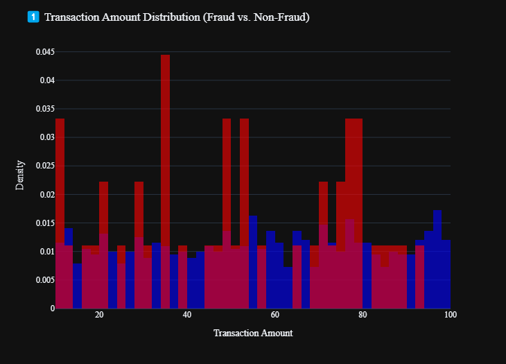

# Final Project

# 🛡️ Fraud Detection with Machine Learning

This notebook explores fraud detection using supervised learning models on a transactional dataset. It includes exploratory data analysis, anomaly detection insights, and a comparison of classification models like Decision Tree, Random Forest, and XGBoost.

---

## 📌 Objectives

- Analyze transaction patterns and distributions
- Explore anomaly scores and time-based fraud trends
- Train and evaluate classification models
- Visualize model performance and feature importance

---

## 📁 Dataset Overview

The dataset contains transaction-level data with fields such as:

- `TransactionAmount`, `Amount`, `Category`
- `AccountBalance`, `Age`, `AnomalyScore`
- `FraudIndicator` (target variable)

---

## 📊 Analysis & Visualizations

Key plots include:

- **Transaction Amount vs. Fraud**

- **Fraud Count by Hour**
.png>)
- **Fraud Rate by Category**
.png>)
- **Model comparison: Accuracy & F1-score (Class 1)**
.png>)

---
| **Model**        | **Speed** | **Interpretability** | **Accuracy** | **Robustness** |
|------------------|-----------|-----------------------|--------------|----------------|
| **Decision Tree**| ✅✅✅    | ✅✅✅✅              | ✅           | ❌              |
| **Random Forest**| ✅✅      | ✅✅                  | ✅✅✅       | ✅✅✅          |
| **XGBoost**      | ✅        | ✅                    | ✅✅✅✅     | ✅✅✅✅        |

## 🤖 Models Compared

| Model          | Strength                             | Weakness                              |
|----------------|--------------------------------------|----------------------------------------|
| Decision Tree  | Best F1 for fraud (Class 1)          | Slightly lower accuracy                |
| Random Forest  | Highest accuracy overall             | Fails to detect fraud                  |
| XGBoost        | Balanced, decent fraud performance   | Lower overall accuracy                 |

---

## 📈 Metrics Evaluated

- Accuracy
- Precision, Recall, F1-score (per class)
- Macro and Weighted F1
- Confusion Matrix

| **Metric**            | **Class** | **Decision Tree** | **Random Forest** | **XGBoost** |
|-----------------------|-----------|-------------------|-------------------|-------------|
| **Precision**         | Class 0   | 0.96              | 0.96              | 0.96        |
|                       | Class 1   | 0.05              | 0.00              | 0.03        |
| **Recall**            | Class 0   | 0.94              | 0.97              | 0.90        |
|                       | Class 1   | 0.08              | 0.00              | 0.08        |
| **F1-score**          | Class 0   | 0.95              | 0.96              | 0.93        |
|                       | Class 1   | 0.06              | 0.00              | 0.05        |
| **Support**           | Class 0   | 287               | 287               | 287         |
|                       | Class 1   | 13                | 13                | 13          |
| **Overall Accuracy**  | —         | 0.90              | 0.93              | 0.87        |
| **Macro Avg (F1)**    | —         | 0.50              | 0.48              | 0.49        |
| **Weighted Avg (F1)** | —         | 0.91              | 0.92              | 0.89        |

## 🔍 Feature Importance

Feature relevance visualized for each model. Top predictors include:

- `AnomalyScore`
- `Working Hours`
- `TransactionAmount`
- `Category`

---

## 🛠️ Requirements

- Python 3.8+
- `pandas`, `numpy`, `seaborn`, `matplotlib`, `plotly`
- `sklearn`, `xgboost`, `statsmodels`